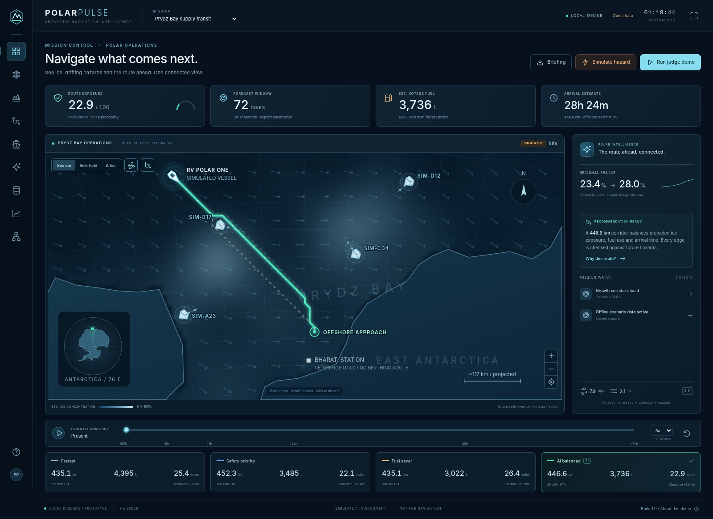

# POLAR PULSE
### Predict. Protect. Navigate.
**An offline Antarctic navigation decision-support research prototype for the supplied SIH Problem Statement 26059.**



## Start here

This is a working local application, not a set of mock-up screenshots. The release includes the **compiled interface, Python backend, trained numerical model, local reference map, synthetic data generators, automated tests and judge-demo documents**.

### Windows: three steps

1. **Extract the ZIP fully** into a normal folder, for example `Downloads\POLAR_PULSE`. Do not run the batch files from the ZIP viewer.
2. Double-click **`SETUP_WINDOWS.bat`** once. This creates a local `.venv` and downloads the Python runtime packages. Use 64-bit Python **3.11, 3.12 or 3.13**; setup searches for those versions.
3. Double-click **`START_WINDOWS.bat`**. Keep its terminal open. Your browser opens when the local server is ready.

Default address: **http://127.0.0.1:8000**

**No Node.js server, Docker, paid map token, OpenAI key, or live-data credentials are required.** Internet is needed for initial package installation, not for the bundled demo. The running application does not request external map tiles, fonts or LLM services. External documentation/source links open only when clicked.

Prefer Chrome or Edge on a laptop. The supplied Windows launchers have been reviewed, but this build was executed and tested on **Linux with Python 3.13.5**, not on a native Windows installation.

### Manual installation

```powershell
# From the extracted project folder, using your installed Python:
python -m venv .venv
.venv\Scripts\python.exe -m pip install -r requirements.txt
.venv\Scripts\python.exe start.py
```

### macOS / Linux

```sh
sh setup.sh
sh start.sh
```

To stop: press **Ctrl+C** in the terminal. To use another port:

```powershell
START_WINDOWS.bat --port 8001
```

**Do not expose this local demo server to the public internet.** It has no authentication, multi-user isolation or production security hardening.

## The experience

The opening screen is a map-led polar operations dashboard with a true south-polar stereographic reference map, custom ship and iceberg symbols, subtle animation, time controls and computed route comparisons.

| Screen | Working behavior |
|---|---|
| Mission control | Map, route choices, estimated fuel/ETA/exposure, scenario alerts, hazard injection and explanations |
| Sea-ice intelligence | Current/forecast/change layers, 0–72 h slider, regional trend and nominal uncertainty |
| Iceberg tracker | Synthetic observed positions, Kalman estimates, vector-forcing trajectories, uncertainty envelopes and CPA/TCPA |
| Route planner | Four weighted-A* policies, safety/fuel/time sliders, map-selected offshore waypoints |
| Voyage simulator | Synchronized ship/drift/sea-ice clock, play/pause/reset, 1×/5×/10× playback |
| Decision center | Same-scenario deltas, explicit exposure contributions, heuristic resilience and state-grounded copilot |
| Data intelligence | Source status, synthetic/real-reference distinction, validated CSV/JSON observation overlays |
| Model performance | Actual scene-held-out synthetic evaluation, baselines, interval coverage and downloadable metrics |
| System architecture | Data-to-decision pipeline, implemented methods and visible limitations |

### The hero interaction

Select **Run judge demo**. The nine-stage story forecasts ice, shows drifting hazards, compares corridors, injects a new synthetic iceberg observation and computes an explained alternative route. Autoplay is approximately one minute; use **Pause / Next** to narrate it over three minutes.

At the default settings, the tested injected scenario gives approximately **9.9 simulated hours of lead time**, changes the old corridor from a negative to a positive modeled clearance margin, and adds approximately **11.5 km, 25 minutes and 62 L**. Those figures come from the engine, not hard-coded KPI cards. Runtime/route-search budgets and altered inputs can change results. The detour is not falsely advertised as saving fuel compared with staying on the old corridor.

Two mission presets are included: **Prydz Bay supply transit** and **East corridor survey**. The vessel **RV POLAR ONE** and both missions are fictional. The supply route ends at a fictional offshore waypoint, not at Bharati station or a berth.

## What really runs

- **Sea ice:** a trained 40-tree random-forest delta forecaster. Numeric JSON trees are loaded by NumPy inference; no unsafe pickled model is loaded.
- **Icebergs:** a four-state linear Kalman filter followed by a simplified current/wind forcing model.
- **Routing:** time-labelled, eight-neighbour weighted A* with a 3.2 heuristic weight and 0.75-hour label bins; four objective/speed policies.
- **Validation:** independent route assessment at roughly 0.5 km spacing, land-segment intersections and analytic piecewise-linear closest approach.
- **Risk:** transparent policy exposure index, **not a calibrated collision probability**.
- **Fuel:** illustrative hotel-load + cubic propulsion + ice drag + wave penalty; **not a real-vessel-calibrated model**.
- **Copilot:** deterministic explanations derived from the active state, **not a connected generative LLM**.

The requested React/Vite preference was replaced with **precompiled TypeScript ES modules and a local SVG/canvas map** to reduce installation and demo failure points. The UI is still interactive; Python serves the interface and APIs on one origin. Node/TypeScript is needed only when editing and rebuilding the frontend source.

## Measured evaluation, not production accuracy

| Synthetic holdout measure | Result |
|---|---:|
| 24 h sea-ice MAE | **1.834 percentage points** |
| 24 h persistence-baseline MAE | 3.882 percentage points |
| 24 h sea-ice RMSE | 2.260 percentage points |
| 24 h nominal-90% interval empirical coverage | 88.86% |
| 72 h nominal-90% interval empirical coverage | 82.86% |
| 48 h iceberg final displacement error | **3.213 km** |
| Sea-ice train / calibration / test scenes | 60 / 15 / 15 |
| Held-out sea-ice rows | 5,250 |
| Independent synthetic iceberg test tracks | 100 |

Whole synthetic scenes, not randomly mixed cells, are held out. High R² on an artificial generator is **not Antarctic accuracy**. Interval coverage is reported honestly, including its long-horizon shortfall.

Full numbers: `models/metrics.json`, `models/iceberg_metrics.json`. Method: `docs/model-methodology.md`.

## Test evidence

- **71 automated tests passed**: algorithms, geography, constraints, API behavior, invalid input handling, independent reroute checks and portable-model metric reproduction.
- **38 browser acceptance checks passed**: nine pages, controls, imports, export, guided story, playback and responsive widths; no browser JavaScript/console errors in that run.
- **9 actual HTTP requests passed** against a separately launched Uvicorn process.

See **[TEST_REPORT.md](TEST_REPORT.md)** for the exact environment, evidence paths and scope. Browser acceptance used the actual compiled interface and actual FastAPI endpoints through a test-only bridge because the managed test browser blocks loopback navigation. Ordinary HTTP serving was independently verified over a real socket. This is not a claim of native Windows or production deployment testing.

## Project map

```text
POLAR_PULSE/
  START_HERE.html             Friendly local quick-start guide
  SETUP_WINDOWS.bat           One-time runtime setup
  START_WINDOWS.bat           Windows launcher
  setup.sh / start.sh         macOS/Linux equivalents
  start.py                    Cross-platform local server launcher
  backend/app/                APIs, environment, forecasts, geometry, routing
  frontend/src/               Editable TypeScript, SVG renderer and CSS
  frontend/dist/              Precompiled, self-contained interface
  models/                     Numerical RF artifact and measured metrics
  ml/                         Reproducible training/evaluation scripts
  data/geography/             Bundled Natural Earth Antarctic reference
  data/demo/                  Synthetic observation CSV and holdout samples
  tests/                     Automated Python tests
  scripts/                   Build, HTTP smoke and browser test utilities
  docs/                      Methods, provenance, architecture and judge guides
  evidence/                  Actual screenshots, logs, exports and test results
```

## Developer commands

```sh
python -m pip install -r requirements-dev.txt
python -m pytest -q
python -m ml.train
python -m ml.evaluate_icebergs
python scripts/http_smoke.py
```

For optional UI development, install Node and run:

```sh
cd frontend
npm install
cd ..
python scripts/build_frontend.py
```

The compiled build already ships; **do not rebuild before your presentation unless you changed source**. After retraining, restart the app so the in-memory model/cache is refreshed.

Browser checks:

```sh
python -m playwright install chromium
python scripts/browser_acceptance.py
```

The test bridge is only in `scripts/browser_support.py`; normal application code uses ordinary same-origin HTTP `fetch`. Browser tests are not needed to run the demo.

## Data and scientific boundaries

The coastline is a coarse, public-domain **Natural Earth reference**, not a marine chart. The Bharati coordinate is an NCPOR station reference, not an approach chart. Satellite concentration, weather, currents, vessel telemetry and iceberg detections are **not live**. NSIDC/ERA5/Copernicus connections are marked **NOT CONNECTED**. Imported observations are **overlay-only**, not operational assimilation.

There are no trained GRU/LSTM/ConvLSTM models, calibrated collision probabilities, deep-learning iceberg detector, bathymetry, real vessel ice-class/manoeuvring constraints, authority approval, authentication, cloud deployment or field validation in this release. These gaps are explicit in `docs/requirements-traceability.md` and `docs/future-scope.md`.

**Research demonstration only. NOT FOR NAVIGATION.** Do not use its routes, scores or fuel estimates for a real voyage.

## Prepare for the judges

Read **[docs/demo-script.md](docs/demo-script.md)** and **[docs/judge-questions.md](docs/judge-questions.md)**. Start with the map and predicted crossing, not a login page or architecture diagram. Keep the offline labeling visible. Describe the executed intelligence chain and acknowledge the real-data validation work still required.
